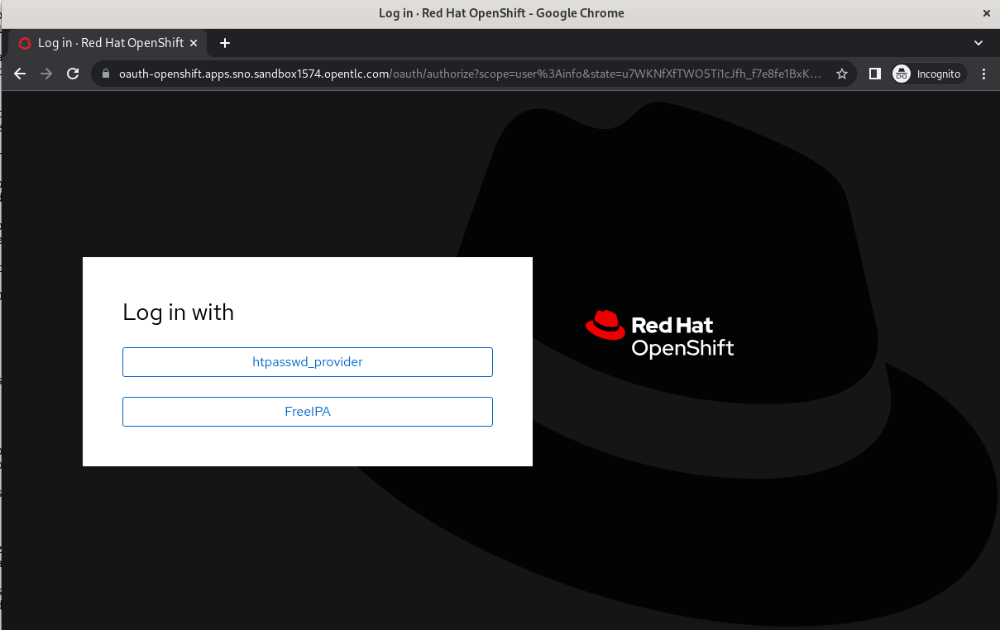

# Keycloak-OCP Groups OIDC example

OAuth2/OIDC Claim is used to synchronize groups from the OpenID Connect provider to OpenShift Container Platform upon user login.

In this example we use Keycloak on a Hub OCP Cluster as the OAuth2/OIDC IDP for a Spoke Cluster.

```bash
---------------------------------------------------------------
| Hub Cluster - OCP with SSO Operator and a Keycloak instance |
---------------------------------------------------------------
                             |
---------------------------------------------------------------
|  Spoke Cluster - has OCP with IDP configured for Keycloak   |
---------------------------------------------------------------
```

## (1) Deploy SSO Operator

On the Hub cluster, deploy the operator.

```bash
oc apply -k sso-operator/
```

## (2) Deploy Keycloak

On the Hub cluster, deploy an SSO instance.

```bash
oc apply -k sso/
```

## (3) Create Realm and Realm Roles

Login to Keycloak as admin, password:

```bash
echo -e $(oc get secret credential-keycloak -n keycloak -o jsonpath='{.data.ADMIN_PASSWORD}' | base64 -d)
```

Create a new Realm for the Spoke cluster e.g. `mx76p`.


Create a couple of Realm Roles (`admin`, `developer`) for testing later on.


## (4) Create a OIDC Client

Crete a new Client `ocp-console` for the console login, openid-connect, confidential, redirect: https://oauth-openshift.apps.mx76p.dynamic.opentlc.com/*,https://console-openshift-console.apps.mx76p.dynamic.opentlc.com/


Create a group `mapper` on the client (in our case using the provider realm role builtin) - this will allow real roles to be used by Spoke Cluster when logging in.


## (5) Setup Identity Brokering

Create an Identity Provider, note down the `secret` you use, the base url is the cluster api.


Authorize the Identity Provider to make OAuth requests in the Hub cluster using the endpoint and secret

```bash
oc create -f <(echo '
kind: OAuthClient
apiVersion: oauth.openshift.io/v1
metadata:
 name: keycloak-broker
secret: "<secret>"
redirectURIs:
 - "https://keycloak-keycloak.apps.sno.sandbox1574.opentlc.com/auth/realms/mx76p/broker/mx76p/endpoint"
grantMethod: prompt 
')
```

## (6) Create a User

You can do this manually in Keycloak. In this example i have created an IPA/LDAP server in the Hub cluster as a source of identity and use that for the IDP integration in the Hub. There is documentation [here](https://eformat.github.io/rainforest-docs/#/1-the-rise-of-the-cluster/1-tooling-installation?id=deploy-ipa) if you want to do that as well.

We then assign `user1` the Role Mappings which will become our `groups` when logging into the Spoke cluster i.e. `admin, developer`.


## (7) Spoke Cluster IDP

We need the CA certs from the Hub Cluster Ingress. Export them.

```bash
echo -e $(oc get secret router-certs -n openshift-ingress --template='{{index .data "tls.crt"}}') | base64 -d > /tmp/ca.crt
```

Create the ConfigMap with the certs in the Spoke Cluster.

```bash
oc create configmap ca-config-map --from-file=ca.crt=/tmp/ca.crt -n openshift-config
```

Using the secret from the ocp-console confidential client, create a secret in the Spoke cluster.

```bash
oc create secret generic idp-secret --from-literal=clientSecret=<secret> -n openshift-config
```

Edit the OAuth cluster in Spoke.

```bash
oc edit OAuth cluster
```

It should look something like this:

```yaml
apiVersion: config.openshift.io/v1
kind: OAuth
metadata:
  name: cluster
spec:
  identityProviders:
  - mappingMethod: claim
    name: keycloak
    openID:
      ca:
        name: ca-config-map
      clientID: ocp-console
      clientSecret:
        name: idp-secret
      extraScopes: 
      - email
      - profile
      extraAuthorizeParameters: 
        include_granted_scopes: "true"
      claims:
        preferredUsername: 
        - preferred_username
        name: 
        - name
        email: 
        - email
        groups: 
        - groups
      issuer: https://keycloak-keycloak.apps.sno.sandbox1574.opentlc.com/auth/realms/mx76p
    type: OpenID
```

Create a call for OpenShift to logout in Keycloak using the back channel.

```bash
oc patch console.config.openshift.io cluster --type=merge -p '{"spec":{"authentication":{"logoutRedirect":"https://keycloak-keycloak.apps.sno.sandbox1574.opentlc.com/auth/realms/mx76p/protocol/openid-connect/logout?client_id=ocp-console"}}}'
```

## Test First Login to Spoke

A successful login sequence looks like this.

Login to the Spoke cluster OpenShift console. Use the `keycloak` provider.


This will redirect you to the Keycloak Realm on the hub cluster. Sign in with the `OpenShift 4` Button at the bottom.


You are presented with the providers from the Hub to authenticate, we use the `FreeIPA` provider in this case.



Login as your user i.e. `user1`.


All going well you will be logged into the Spoke Cluster now OK.


We can test logout, which should take you to the Keycloak realm and prompt you to logout your session.


We should see the `user` and `groups` created automatically from the OIDC claim OK in the Spoke cluster.


If you remove the Realm Role (`admin` or `developer`) this will be updated in your group membership.

RBAC would be assigned to your groups in the Spoke cluster separately.
